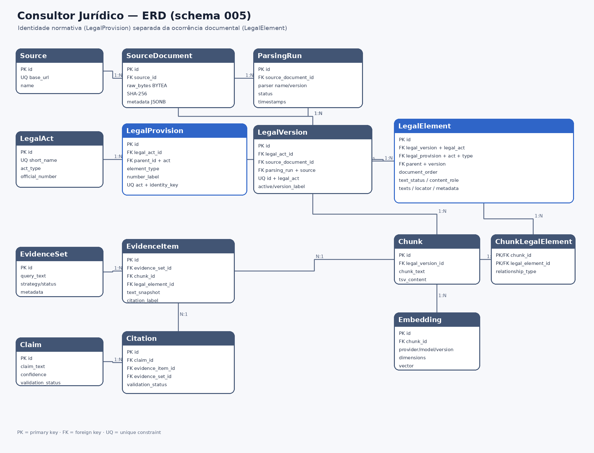

# Consultor Jurídico

> RAG jurídico local, auditável e orientado a fontes primárias para consulta da legislação brasileira.


O **Consultor Jurídico** é um projeto open-source para consulta jurídica baseada em legislação oficial, versionada, rastreável e verificável. O objetivo é construir um sistema RAG no qual a IA possa **interpretar evidências**, mas nunca substituir a fonte jurídica oficial como autoridade.

No MVP 1, o corpus é restrito à **Constituição Federal de 1988 (CF/88)** e ao **Ato das Disposições Constitucionais Transitórias (ADCT)**, capturados diretamente do Portal do Planalto.

> [!IMPORTANT]
> O projeto prioriza **proveniência, determinismo, integridade documental e validação de evidências**. Uma resposta só deve ser considerada confiável quando puder ser rastreada até o texto oficial que a fundamenta.

> [!NOTE]
> Este projeto é uma ferramenta de pesquisa e engenharia de informação jurídica. Ele não substitui aconselhamento jurídico profissional.

---

## Sumário

- [Visão geral](#visão-geral)
- [Estado atual do MVP](#estado-atual-do-mvp)
- [Princípios de arquitetura](#princípios-de-arquitetura)
- [Arquitetura de alto nível](#arquitetura-de-alto-nível)
- [Relatório científico de seleção de modelos locais — MVP1](docs/relatorio-cientifico-selecao-modelos-mvp1.md)
- [Pipeline documental](#pipeline-documental)
- [Pipeline de consulta jurídica](#pipeline-de-consulta-jurídica)
- [Cadeia de rastreabilidade](#cadeia-de-rastreabilidade)
- [Modelagem do banco de dados](#modelagem-do-banco-de-dados)
- [Retrieval híbrido](#retrieval-híbrido)
- [Quick start](#quick-start)
- [Comandos principais](#comandos-principais)
- [Desenvolvimento local](#desenvolvimento-local)
- [Testes e qualidade](#testes-e-qualidade)
- [Roadmap](#roadmap)
- [Estrutura do projeto](#estrutura-do-projeto)
- [Documentação](#documentação)
- [Contribuindo](#contribuindo)
- [Escopo e limitações](#escopo-e-limitações)

---

## Visão geral

O sistema foi projetado para responder a uma pergunta simples de engenharia:

> **Como permitir que um modelo de linguagem auxilie uma consulta jurídica sem transformar o próprio modelo em fonte de verdade?**

A resposta arquitetural é separar responsabilidades.

O LLM não lê diretamente “toda a Constituição” e não decide sozinho quais dispositivos são relevantes. Antes da geração, o sistema:

1. captura e preserva a fonte oficial;
2. valida a integridade dos bytes;
3. transforma o documento em uma estrutura jurídica determinística;
4. separa identidade normativa de ocorrência documental;
5. materializa o corpus no PostgreSQL;
6. gera chunks rastreáveis;
7. executa busca lexical e vetorial;
8. seleciona evidências;
9. entrega apenas essas evidências ao modelo;
10. valida claims e citações antes de considerar uma resposta fundamentada.

A interface do MVP é **CLI-first**. Não há frontend nem API HTTP nesta etapa.

### Corpus do MVP 1

| Item | Escopo |
|---|---|
| Fonte oficial | Portal do Planalto |
| Atos jurídicos | CF/88 e ADCT |
| Captura | HTML oficial preservado byte a byte |
| Interface | CLI |
| Banco | PostgreSQL 16 + pgvector |
| IA local | Ollama |
| Embeddings | `nomic-embed-text`, 768 dimensões |
| Busca | PostgreSQL FTS + pgvector + RRF |
| Frontend | Fora do escopo do MVP 1 |
| API HTTP | Fora do escopo do MVP 1 |

---

## Estado atual do MVP

A infraestrutura documental, estrutural, de retrieval e consulta fundamentada
está implementada. A Fase 7.2 elevou o Hybrid Hit@10 a 0,905 e preservou zero
respostas inseguras nos nove casos de abstenção, mas permaneceu
`MVP1_QUALITY_BLOCKED` por três false abstentions do `llama3.2` como
gerador e juiz.

A Fase 7.3 fechou o gate por **benchmark de modelos locais**: troca isolada
do juiz semântico para **`granite4.1:3b`** (gerador permanece `llama3.2`)
elevou o recall SUPPORTED de 0,750 → 1,000, manteve `unsafe acceptance = 0` e
resolveu a amostra de regressão de 0/3 → **3/3 respondidas** sem respostas
inseguras. O gate é agora **`MVP1_QUALITY_APPROVED`**. Detalhes em
`docs/60-fase-7-3-quality-gate-final.md` (e `docs/61-fase-7-3` se renumerado).

A Fase 8 concluiu a **CLI interativa**: `consultor-juridico` sem argumentos
abre menu Rich em TTY (consulta, pesquisa, estado, diagnóstico, sobre, sair),
exibe `help` em non-TTY, trata `Ctrl+C`/`EOF` sem traceback e oferece aliases
`constituicao` para `ingest` e `parse`. O container padrão agora usa
`CMD ["consultor-juridico"]` sem `ENTRYPOINT` fixo, permitindo
`docker compose run --rm app bash`.

A Fase 9 criou o dataset `real-world-short-v1` (11 consultas curtas: pena de
morte, prisão perpétua, liberdade religiosa, racismo, extradição, direito à
vida, liberdade de expressão, idade para ser presidente, voto obrigatório,
estado de sítio, aborto). Hybrid Hit@10 foi de 0,700 → **0,800** (Hit@1 0,300,
MRR 0,405) com correção geral em `search.py:34-105` (phrase boost + boost
lexical para queries ≤3 tokens), sem hardcode por caso e sem regressão em
`mvp1-v1` (0,905).

A Fase 9.1 mediu o pipeline completo no `real-world-short-v1` com
`llama3.2` + `granite4.1:3b`:
`correct_answers 2/10`, `correct_abstentions 1/1` (aborto),
`false_abstentions 8`, `unsafe 0`, `retrieval_hit 0,800`. Gate
`REAL_WORLD_RELEASE_BLOCKED` (requer ≥9/10), mas `MVP1_QUALITY_APPROVED`
permanece (0,905, unsafe 0). Diagnóstico aponta gargalo em
**evidence selection/sufficiency** (4) > retrieval (2) > generator (2).
Logging hardening: `engine.echo=False` por padrão, `--verbose/-v` habilita SQL.
Detalhes em `docs/61-fase-9-hardening-retrieval.md` e
`docs/62-fase-9-1-gate-real-world.md`.

A Fase 11 aplicou um plano fechado de hardening sistêmico em selection,
sufficiency, attribution e detecção de exceções. A avaliação final única
elevou o real-world de **4/10 para 7/10**, reduziu falsas abstenções de seis
para três, preservou `1/1` abstenção correta, `unsafe=0`, cadeias de citação
válidas e Hit@10 real-world `0,900`/MVP1 `0,905`. O resultado é
`QUALITY_BREAKTHROUGH_GATE: PARTIAL`: houve ganho transversal, mas o release
continua bloqueado. A SEU 10.1 permanece experimental e não integrada.
Detalhes em `docs/83-fase-11-quality-breakthrough.md`.

A Fase 11.1 implementou selection por contribuição marginal e attribution por
cláusula com diagnóstico auditável. O inciso IX passou a ser preservado para
liberdade de expressão, mas o blocker migrou para attribution simples; estado
de sítio não produziu claim composta utilizável e pena de morte absteve no
Generator. A avaliação única permaneceu em **7/10**, com `1/1` abstenção
correta, `unsafe=0` e MVP1 Hit@10 `0,905`. Assim,
`COMPOSITE_SUPPORT_GATE: BLOCKED`; não houve tuning após o benchmark e a
recomendação é revisão arquitetural. Detalhes em
`docs/84-fase-11-1-composite-support.md`.

A Fase 12 implementou experimentalmente SupportSlots verificáveis e geração
atômica pré-vinculada a um único EvidenceItem. Provenance, parent context,
hashes, binding e controles adversariais passaram, e liberdade de expressão foi
recuperada. A auditoria corrigiu uma inflação metodológica que contava qualquer
`ANSWERED` como acerto: prisão perpétua e estado de sítio receberam respostas
sem binding a uma provision esperada/aceitável. O resultado real permaneceu em
**7/10**, com duas respostas off-target e pena de morte abstida. Assim,
`EVIDENCE_BOUND_GENERATION_GATE: BLOCKED` e a arquitetura não foi integrada em
produção. Detalhes em `docs/85-fase-12-evidence-bound-atomic-generation.md`.

O experimento offline de **Verified Core Support Assertion (VCSA)** validou a
reconstrução literal e rastreável de parent direto + child, recuperando pena de
morte e preservando exceções sem LLM. Prisão perpétua revelou um
`RELEVANCE_LIMIT` entre “prisão” e “pena”; o resultado potencial foi `8/10`,
`unsafe=0`, sem integração em produção. Detalhes em
`docs/87-experimento-vcsa-verified-core-support-assertion.md`.

O experimento offline de **Semantic Core Relevance** comparou baseline lexical,
`nomic-embed-text` e judge local sobre `Query ↔ Core Assertion` já verificadas.
Embeddings não obtiveram separação segura nos controles; o judge recuperou
prisão perpétua, mas aceitou controles off-target. Assim,
`SEMANTIC_CORE_RELEVANCE_EXPERIMENT: FAIL`, com nenhuma integração de produção.
Detalhes em `docs/88-experimento-semantic-core-relevance.md`.

A revisão arquitetural subsequente congelou **cross-encoder pairwise** como a
próxima capacidade a avaliar para `Query ↔ Core Assertion`, sem autorizar
implementação. O benchmark futuro fica limitado ao MiniLM mMARCO como primary e
ao BGE reranker v2-m3 como controle, com score e zona `UNRESOLVED`. VCSA
permanece foundation; Evidence-Bound permanece experimental. Detalhes em
`docs/89-model-architecture-review.md`.

A Fase 90 executou o MiniLM em ONNX CPU: prisão perpétua e pena de morte foram
classificadas como relevantes, mas houve 3 falsos relevantes, incluindo ator
jurídico incorreto. O BGE não concluiu o download do peso no ambiente e ficou
`NOT_RUN`; portanto o benchmark comparativo é inconclusivo e nenhum modelo foi
integrado. Detalhes em `docs/90-controlled-relevance-model-benchmark.md`.

A Fase 91 iniciou o benchmark definitivo dos sete modelos Ollama, mas foi
interrompida após sete chamadas parciais por custo de inferência sequencial em
CPU. Nenhuma seleção definitiva foi feita; o harness é resumível e o MVP1
continua sem modelo novo integrado. Detalhes em
`docs/91-definitive-mvp1-model-benchmark.md`.

A Fase 91.1 reorganizou a seleção em estágios com eliminação precoce, mas o
primeiro kill-test não pôde ser concluído nesta sessão por limitação operacional
de execução prolongada contra o daemon Ollama. Nenhum modelo foi eliminado e a
seleção continua inconclusiva. Detalhes em
`docs/91-1-staged-model-elimination.md`. O semantic kill-test manual está
concluído; o harness do generator kill-test foi preparado com EvidenceSets
congelados, mas sua execução permanece manual e ainda não houve seleção de
modelo. O Generator Kill-Test foi posteriormente fechado com retry de 512
tokens e merge determinístico; `ministral-3:8b` é apenas survivor provisório
(`SAFE_BUT_LOW_RECALL`) aguardando Capability Confirmation.
Capability Confirmation foi concluída sem unsafe acceptance; o próximo passo é
um único screen E2E da configuração single-model, ainda sem seleção definitiva
de modelo de produção. O pre-E2E hardening canonicalizou abstentions,
explicitou `think=false` e criou `evaluation.e2e_single_model_91`, que usa o
serviço real de consulta; o screen continua pendente de execução manual.

O benchmark staged está preparado para execução manual local: perfil desktop,
um modelo/requisição por vez, checkpoints e log persistente. A primeira etapa é
`relevance-kill`; use `--resume` e, para execução longa, `tmux`. A execução do
agente não mantém inferências longas nem integra modelos em produção.

O harness também trata respostas Qwen/DeepSeek por capability da API
(`think=false`, content final separado de thinking, falhas operacionais
reexecutáveis) e permite filtrar modelos com `--models`. O primeiro rerun manual
deve limitar-se aos três modelos que tiveram falha operacional anterior.

### Corpus materializado

```text
sources             = 1
source_documents    = 1
parsing_runs        = 1
legal_acts          = 2
legal_versions      = 2
legal_provisions    = 4096
legal_elements      = 6775
chunks              = 3389
embeddings          = 3389
```

Distribuição jurídica materializada:

| Ato | LegalVersions | LegalProvisions | LegalElements |
|---|---:|---:|---:|
| CF/88 | 1 | 3.133 | 5.063 |
| ADCT | 1 | 963 | 1.712 |

A captura oficial atualmente preservada possui:

```text
bytes:
1839482

SHA-256:
25b6934ef228df40d0f5d35e225f6f7160b98f32dd2de328ad9fed9d97496a3d
```

### Retrieval atual

A Fase 5 implementou:

- chunking jurídico determinístico `legal_occurrence_current_v1`;
- 3.389 chunks;
- PostgreSQL FTS em português;
- 3.389 embeddings locais;

A avaliação `mvp1-v1` (30 casos) mede 21 perguntas respondíveis e nove de
abstenção. Na Fase 7.2, Hybrid Hit@10 = 0,905, MRR = 0,627 e Recall@10 = 0,881.
Na Fase 7.3, o juiz `granite4.1:3b` manteve Hit@10 = 0,905, elevou recall
SUPPORTED a 1,000 e respondeu 3/3 da amostra de regressão. Os nove casos
fora/insuficientes seguem recusados sem resposta insegura. A seleção usa em
média 2,67 EvidenceItems, sem duplicação por provision. Resultados em
[`docs/58-fase-7-2-fechamento-gate-mvp1.md`](docs/58-fase-7-2-fechamento-gate-mvp1.md)
e [`docs/60-fase-7-3-quality-gate-final.md`](docs/60-fase-7-3-quality-gate-final.md).
- `ollama/nomic-embed-text/latest`;
- 768 dimensões;
- busca vetorial por distância de cosseno;
- busca híbrida com Reciprocal Rank Fusion (RRF);
- promoção contextual auditável de CAPUT já recuperado por um componente;
- filtros por ato e tipo jurídico;
- idempotência de indexação;
- CLI de diagnóstico.

A avaliação diagnóstica inicial obteve **5/5 dispositivos esperados no top-10 híbrido**. Essa medição é um smoke test, não a avaliação final do sistema.

### Próximo marco

A próxima fase implementa a camada que transforma retrieval em resposta fundamentada:

```text
EvidenceSet
→ EvidenceItems
→ Prompt grounded
→ LLM local
→ Claims
→ Citations
→ Citation Validation
→ Resposta validada
```

---

## Princípios de arquitetura

### 1. A fonte oficial é a autoridade

O sistema preserva o documento oficial antes de qualquer parsing, normalização ou interpretação.

```text
Portal do Planalto
        ↓
SourceDocument.raw_bytes
```

Os bytes são armazenados sem canonicalização e protegidos por SHA-256.

### 2. O LLM não é fonte de verdade

O modelo pode interpretar evidências recuperadas, mas não pode substituir a legislação oficial.

```text
legislação oficial
        ↓
evidência
        ↓
LLM
```

Nunca:

```text
LLM
 ↓
"verdade jurídica"
```

### 3. Captura, parsing e versão jurídica são conceitos distintos

```text
SourceDocument
≠
ParsingRun
≠
LegalVersion
```

Uma nova versão do parser não significa que a fonte oficial mudou.

### 4. Identidade normativa e ocorrência documental são separadas

```text
LegalProvision
= identidade normativa estável

LegalElement
= ocorrência documental/versionada
```

Essa separação permite representar múltiplas redações históricas do mesmo dispositivo sem criar identidades jurídicas duplicadas.

### 5. Incerteza não é apagada

Quando a fonte não fornece informação suficiente para uma classificação segura, o sistema pode preservar:

```text
UNRESOLVED
```

em vez de inferir silenciosamente um estado jurídico.

### 6. Invariantes simples pertencem ao banco

FKs, UNIQUEs e CHECKs protegem regras relacionais estáveis.

Regras que exigem interpretação histórica, comparação de árvores ou semântica permanecem na aplicação e na auditoria.

### 7. Tudo que fundamenta uma resposta precisa ser rastreável

A arquitetura é orientada à cadeia:

```text
Claim
→ Citation
→ EvidenceItem
→ Chunk
→ LegalElement
→ LegalProvision
→ LegalVersion
→ ParsingRun
→ SourceDocument
→ Source
```

---

## Arquitetura de alto nível

```text
┌───────────────────────────────────────────────────────────────┐
│                           Usuário                             │
└───────────────────────────────┬───────────────────────────────┘
                                │
                                ▼
┌───────────────────────────────────────────────────────────────┐
│                              CLI                              │
└───────────────────────────────┬───────────────────────────────┘
                                │
                                ▼
┌───────────────────────────────────────────────────────────────┐
│                    Application Services                       │
│                                                               │
│   Ingestion   Parsing   Materialization   Retrieval   RAG     │
└───────────┬───────────┬───────────┬─────────────┬─────────────┘
            │           │           │             │
            ▼           ▼           ▼             ▼
      ┌──────────┐  ┌───────────────────────┐  ┌───────────┐
      │ Planalto │  │ PostgreSQL + pgvector │  │  Ollama   │
      └──────────┘  └───────────────────────┘  └───────────┘
```

O PostgreSQL armazena tanto o corpus jurídico estruturado quanto os dados derivados de retrieval e, futuramente, de evidence/citation.

O Ollama é usado localmente. Na Fase 5, ele fornece embeddings; na Fase 6, passa a fornecer também o modelo generativo local.

---


### Avaliação científica e seleção de modelos locais

A seleção dos modelos do MVP1 foi conduzida por um protocolo experimental em estágios, com avaliação independente dos papéis de **Relevance Judge**, **Semantic/Support Judge** e **Generator**, critérios fail-closed, kill-tests adversariais e confirmação com múltiplas repetições.

Os resultados atuais apontam `ministral-3:8b` como **único candidato single-model** que permaneceu elegível nos três papéis. A seleção final de produção ainda depende do screening end-to-end e dos testes de estabilidade.

- [Relatório científico de seleção de modelos locais — MVP1](docs/relatorio-cientifico-selecao-modelos-mvp1.md)

---

## Pipeline documental

Antes de existir retrieval ou LLM, o sistema precisa transformar o documento oficial em uma representação jurídica auditável.

```text
Portal do Planalto
        ↓
Raw SourceDocument
        ↓
SHA-256 / integridade
        ↓
Decoder Windows-1252
        ↓
DOM íntegro
        ↓
DocumentBlock
        ↓
Segmentação CF/88 + ADCT
        ↓
Parser jurídico em memória
        ↓
LegalProvision + LegalElement
        ↓
Auditoria estrutural
        ↓
Materialization Gate
        ↓
Materialização transacional
        ↓
PostgreSQL
```

### Captura oficial

A captura da CF/88 e ADCT é preservada como um único `SourceDocument` físico.

O HTML é armazenado em `BYTEA`, e o hash SHA-256 é calculado sobre exatamente os bytes persistidos.

A ingestão também utiliza `ETag` e `Last-Modified` para conditional GET, permitindo o fluxo:

```text
200 CREATED
    ↓
304 ALREADY_KNOWN
```

sem criar capturas desnecessárias.

### Parsing determinístico

O parser transforma a estrutura documental em elementos jurídicos:

```text
DOCUMENT_ROOT
PREAMBLE
TITLE
CHAPTER
SECTION
SUBSECTION
ARTICLE
CAPUT
PARAGRAPH
INCISO
ALINEA
ITEM
NOTE
```

Cada elemento preserva ordem, proveniência e metadata factual suficiente para auditoria.

### Identidade normativa

A fonte oficial contém múltiplas redações históricas de certos dispositivos.

Em vez de transformar cada redação em uma identidade diferente:

```text
Art. 6 histórico A  → identidade A
Art. 6 histórico B  → identidade B
Art. 6 atual        → identidade C
```

o modelo usa:

```text
LegalProvision Art. 6
        ▲
        ├── LegalElement HISTORICAL
        ├── LegalElement HISTORICAL
        └── LegalElement CURRENT
```

A identidade normativa permanece estável; as ocorrências documentais preservam as diferentes redações.

### Materialização transacional

A persistência segue um modelo transacional:

```text
TX1
→ ParsingRun RUNNING
→ commit

parse + audit em memória

TX2
→ LegalAct
→ LegalProvision
→ LegalVersion
→ LegalElement
→ ativação das versões
→ ParsingRun COMPLETED
→ commit
```

Em caso de falha:

```text
TX2 rollback
    ↓
TX3
→ ParsingRun FAILED
→ commit
```

CF/88 e ADCT são ativados conjuntamente. A materialização não aceita um estado em que apenas um dos atos tenha sido persistido com sucesso.

---

# Pipeline de consulta jurídica

O pipeline abaixo está implementado até a validação final da Fase 6. O modelo
local recebe exclusivamente o snapshot de evidências recuperadas; Claims só são
persistidas quando todas as Citations passam pela validação determinística.

```text
User Query
    ↓
    Hybrid Retrieval
    ↓
    Evidence Selection
    ↓
    Evidence Sufficiency Gate
    ↓
EvidenceSet
    ↓
EvidenceItems
    ↓
Prompt grounded
    ↓
LLM local
    ↓
Claims
    ↓
Citations
    ↓
    Structural Citation Validation
    ↓
    Semantic Support Validation
    ↓
    Resposta validada / Abstenção
```

O desenho pode ser entendido como uma sequência de filtros. A pergunta começa ampla, o sistema localiza trechos relevantes da legislação, congela as evidências utilizadas, entrega apenas essas evidências ao modelo local, transforma a saída em afirmações verificáveis e valida se cada afirmação está realmente sustentada.

O gerador local é configurado por `OLLAMA_MODEL` (`llama3.2` por padrão).
O juiz semântico usa `SEMANTIC_JUDGE_MODEL` — na configuração validada da
Fase 7.3, `granite4.1:3b`; quando a variável não é definida, utiliza o mesmo
modelo do gerador. Erro técnico, contrato inválido, suporte parcial ou
ausente resultam em abstenção (fail-closed).

---

## User Query

`User Query` é a pergunta enviada pelo usuário.

Exemplo:

```text
O que a Constituição estabelece sobre a liberdade de manifestação do pensamento?
```

Nesse ponto, a pergunta ainda não está associada a um dispositivo específico.

O sistema não deve enviá-la imediatamente ao modelo de linguagem. Primeiro precisa identificar quais partes da CF/88 ou do ADCT podem sustentar uma resposta.

Essa decisão evita que o modelo:

- responda a partir de memória interna;
- misture versões da legislação;
- cite dispositivos inexistentes;
- use normas fora do corpus do MVP.

---

## Retrieval

`Retrieval` é a etapa que procura os trechos jurídicos potencialmente relevantes.

O sistema implementa três modos.

### Busca lexical

A busca lexical usa PostgreSQL Full-Text Search:

```text
to_tsvector('portuguese', chunk_text)
+
websearch_to_tsquery('portuguese', query)
+
ts_rank_cd(...)
```

Ela funciona especialmente bem quando a consulta contém termos próximos aos usados pela Constituição.

### Busca vetorial

A busca vetorial representa consulta e chunks matematicamente por embeddings.

```text
query
  ↓
search_query: ...
  ↓
embedding 768D

chunk
  ↓
search_document: ...
  ↓
embedding 768D
```

A similaridade atual é calculada por distância de cosseno.

### Busca híbrida

O modo padrão combina lexical e vetorial por Reciprocal Rank Fusion:

```text
RRF score = Σ 1 / (60 + rank)
```

Isso evita combinar diretamente scores com escalas incompatíveis.

### Escopo jurídico padrão

O retrieval não pesquisa indiscriminadamente todo conteúdo persistido.

O índice padrão é formado por ocorrências:

```text
LegalVersion ativa
+
text_status = CURRENT
+
content_role = NORMATIVE
```

Logo, redações históricas, dispositivos revogados, conteúdo `UNRESOLVED` e notas editoriais não entram silenciosamente como fundamento da consulta comum.

---

## EvidenceSet

`EvidenceSet` representa o conjunto fechado de evidências selecionadas para uma execução específica.

Conceitualmente:

```text
User Query
    ↓
Retrieval
    ↓
E1
E2
E3
E4
E5
    ↓
EvidenceSet
```

O conjunto registra informações como:

- consulta original;
- estratégia de retrieval;
- quantidade de evidências;
- metadata da execução;
- status de validação.

Duas execuções da mesma pergunta podem produzir EvidenceSets diferentes se o corpus, índice, embedding ou configuração tiverem mudado.

Por isso, `EvidenceSet` representa **uma execução auditável**, e não apenas uma pergunta abstrata.

---

## EvidenceItems

Cada evidência selecionada é representada por um `EvidenceItem`.

```text
EvidenceSet
├── E1 → CF/88, art. 5º, IV
├── E2 → CF/88, art. 220
└── E3 → outro dispositivo recuperado
```

O EvidenceItem mantém referências para o material jurídico de origem e guarda um `text_snapshot`.

### Por que existe um snapshot?

O snapshot responde:

> **Qual texto exatamente foi apresentado ao modelo nesta execução?**

Isso é essencial porque, no futuro:

- a legislação pode ter nova captura;
- uma nova LegalVersion pode ser ativada;
- chunks podem ser reconstruídos;
- embeddings podem ser trocados.

Mesmo assim, uma resposta histórica precisa continuar auditável.

---

## Prompt grounded

Depois que as evidências são selecionadas, o sistema constrói um prompt ancorado nelas.

Em vez de perguntar:

```text
O que você sabe sobre liberdade de expressão?
```

o sistema trabalha conceitualmente com:

```text
Pergunta:
O que a Constituição estabelece sobre liberdade de expressão?

Evidência E1:
[CF/88, art. 5º, IV]
...

Evidência E2:
[CF/88, art. 220]
...

Instruções:
- responda somente com base nas evidências;
- não use conhecimento externo;
- não invente dispositivos;
- associe cada afirmação às evidências;
- declare insuficiência quando o corpus não sustentar a resposta.
```

O modelo deixa de ser consultado como “memória jurídica” e passa a atuar como **interpretador de um conjunto fechado de evidências**.

---

## LLM local

O LLM é executado localmente via Ollama.

Na arquitetura-alvo, recebe:

```text
User Query
+
EvidenceItems
+
instruções de grounding
```

e produz saída estruturada, por exemplo:

```json
{
  "answer": "A Constituição assegura...",
  "claims": [
    {
      "claim_code": "C1",
      "text": "A manifestação do pensamento é livre, sendo vedado o anonimato.",
      "evidence_codes": ["E1"]
    }
  ],
  "insufficient_evidence": false
}
```

O modelo não deve produzir a fonte jurídica como autoridade livre.

Ele apenas declara quais códigos de evidência sustentariam cada claim:

```text
C1 → E1
```

A aplicação resolve `E1` para a referência jurídica real.

---

## Claims

Um `Claim` representa uma afirmação verificável.

Exemplo:

```text
A manifestação do pensamento é livre, sendo vedado o anonimato.
```

A resposta completa pode conter vários Claims:

```text
Resposta
├── Claim C1
├── Claim C2
└── Claim C3
```

Isso permite validar cada proposição individualmente.

Uma resposta pode conter uma primeira afirmação corretamente fundamentada e uma segunda extrapolada. Se toda a saída fosse tratada como uma única unidade, detectar esse problema seria muito mais difícil.

---

## Citations

`Citation` é a relação persistida entre um Claim e um EvidenceItem.

```text
Claim C1
   ↓
Citation
   ↓
EvidenceItem E1
```

Uma afirmação pode ter várias citações:

```text
Claim C2
├── Citation → E2
└── Citation → E3
```

O label apresentado ao usuário deve ser derivado do domínio:

```text
E1
→ LegalElement
→ LegalProvision
→ CF/88, art. 5º, IV
```

e não inventado pelo LLM.

Assim, o modelo pode dizer:

```text
C1 usa E1
```

e a aplicação monta:

```text
[CF/88, art. 5º, IV]
```

---

## Citation Validation

Pedir ao LLM que informe evidências não basta. É necessário verificar se as citações são válidas e suficientes.

A arquitetura prevê validação em várias dimensões.

### Validade referencial

O código de evidência realmente existe?

### Consistência do EvidenceSet

A evidência pertence ao mesmo conjunto da consulta?

O PostgreSQL já possui integridade composta para impedir fisicamente que uma Citation declare pertencer a um EvidenceSet enquanto referencia uma evidência de outro.

### Status jurídico

A evidência continua compatível com o escopo da consulta padrão?

```text
CURRENT
+
NORMATIVE
+
LegalVersion ativa
```

### Suporte semântico

O conteúdo da evidência realmente sustenta o Claim?

Ter palavras em comum não é suficiente.

### Completude

Existe afirmação jurídica relevante sem citação?

Se existir, a resposta ainda não está completamente fundamentada.

### Extrapolação

A evidência sustenta apenas parte da afirmação?

Nesse caso, o sistema deve identificar suporte parcial, reformular ou rejeitar o Claim.

---

## Resposta validada

Somente após a validação a resposta pode ser apresentada como fundamentada.

```text
LLM gera resposta candidata
        ↓
Claims
        ↓
Citations
        ↓
Citation Validation
        ↓
apenas Claims suportados permanecem
        ↓
Resposta validada
```

Se o corpus não fornecer evidência suficiente, o comportamento correto é se abster.

Exemplo conceitual:

```text
Não encontrei evidência suficiente na Constituição Federal e no ADCT
para responder com segurança a essa parte da consulta.
```

O sistema não deve completar lacunas usando conhecimento geral do modelo.

Para uma descrição ainda mais detalhada desse fluxo, consulte:

[`docs/55-arquitetura-consulta-rastreabilidade.md`](docs/55-arquitetura-consulta-rastreabilidade.md)

---

# Cadeia de rastreabilidade

Além do pipeline de execução, existe uma cadeia de custódia que explica de onde veio cada afirmação:

```text
Claim
→ Citation
→ EvidenceItem
→ Chunk
→ LegalElement
→ LegalProvision
→ LegalVersion
→ ParsingRun
→ SourceDocument
→ Source
```

Cada entidade resolve uma pergunta diferente.

| Entidade | Pergunta que responde |
|---|---|
| `Claim` | O que o sistema afirmou? |
| `Citation` | Qual evidência foi usada para sustentar a afirmação? |
| `EvidenceItem` | Qual texto exato foi entregue como evidência? |
| `Chunk` | Qual unidade foi recuperada pelo mecanismo de busca? |
| `LegalElement` | Qual ocorrência documental concreta originou o trecho? |
| `LegalProvision` | Qual é a identidade normativa estável do dispositivo? |
| `LegalVersion` | Em qual snapshot jurídico do ato essa ocorrência existe? |
| `ParsingRun` | Qual parser e versão produziram esse snapshot? |
| `SourceDocument` | Qual captura física oficial foi processada? |
| `Source` | De qual fonte institucional veio o documento? |

---

## Claim

`Claim` é uma afirmação jurídica produzida pelo sistema.

Exemplo:

```text
A educação é direito de todos e dever do Estado e da família.
```

O Claim não é a evidência. É aquilo que o sistema pretende afirmar ao usuário.

Sua existência permite validar a resposta em unidades semânticas menores.

---

## Citation

`Citation` liga um Claim a um EvidenceItem.

Ela responde:

> Qual evidência sustenta esta afirmação?

A Citation não é apenas texto decorativo no fim da resposta. É uma relação persistida no banco e protegida por integridade referencial.

---

## EvidenceItem

`EvidenceItem` representa a evidência concreta usada naquela execução.

Ele contém:

- EvidenceSet;
- Chunk de origem;
- LegalElement relacionado;
- código de evidência;
- label jurídico;
- snapshot textual;
- metadata de validação.

O EvidenceItem é a ponte entre retrieval e geração.

---

## Chunk

`Chunk` é a unidade usada pelo mecanismo de busca.

A estrutura jurídica é hierárquica:

```text
ARTICLE
├── CAPUT
├── PARAGRAPH
│   ├── INCISO
│   └── INCISO
└── ...
```

O retrieval precisa de unidades menores e pesquisáveis sem perder rastreabilidade.

Na estratégia atual, `ARTICLE` funciona como container e não duplica o texto do `CAPUT`. Os chunks são derivados das ocorrências normativas correntes.

O chunk não é autoridade jurídica por si só. Ele aponta para os LegalElements que o originaram.

---

## LegalElement

`LegalElement` representa uma ocorrência documental concreta dentro de uma `LegalVersion`.

Exemplos:

```text
ARTICLE
CAPUT
PARAGRAPH
INCISO
ALINEA
ITEM
SECTION
NOTE
```

Ele contém atributos ligados à ocorrência:

- texto;
- ordem documental;
- status;
- papel do conteúdo;
- provenance;
- locator;
- metadata do parser.

Um mesmo dispositivo pode ter múltiplas ocorrências históricas.

Por isso, `LegalElement` não é a identidade abstrata do dispositivo.

---

## LegalProvision

`LegalProvision` representa a identidade normativa estável.

Exemplo:

```text
LegalProvision Art. 6º
        ▲
        ├── LegalElement HISTORICAL
        ├── LegalElement HISTORICAL
        └── LegalElement CURRENT
```

A diferença pode ser resumida assim:

```text
LegalProvision
= qual dispositivo é

LegalElement
= como esse dispositivo aparece naquela versão documental
```

Essa separação evita duplicar identidades jurídicas quando a fonte apresenta redações anteriores.

---

## LegalVersion

`LegalVersion` representa um snapshot jurídico estruturado de um ato.

CF/88 e ADCT são LegalActs distintos, embora possam derivar do mesmo SourceDocument físico.

Para uma captura:

```text
SourceDocument
├── LegalVersion CF/88
└── LegalVersion ADCT
```

Uma LegalVersion contém sua árvore de occurrences e referencia o ParsingRun que a produziu.

Somente uma versão por LegalAct fica ativa para consulta padrão.

---

## ParsingRun

`ParsingRun` representa uma execução lógica do parser.

Sua identidade considera:

```text
SourceDocument
+
parser_name
+
parser_version
```

Estados:

```text
RUNNING
COMPLETED
FAILED
```

Isso permite distinguir:

```text
a fonte mudou
```

de:

```text
o parser mudou
```

A mesma captura pode ser reprocessada por outra versão do parser sem significar que houve nova publicação oficial.

---

## SourceDocument

`SourceDocument` representa a captura física do documento oficial.

Ele preserva:

```text
raw_bytes
content_hash_sha256
HTTP metadata
timestamp de captura
```

Seu papel é permitir provar que o sistema estruturou determinado conjunto de bytes provenientes da fonte oficial.

`SourceDocument` não é uma versão jurídica.

É a evidência documental bruta.

---

## Source

`Source` representa a origem institucional.

No MVP 1:

```text
Source
= Portal do Planalto
```

No futuro, novas fontes oficiais podem ser adicionadas sem alterar o significado das demais entidades.

---

## Exemplo completo de rastreabilidade

Considere:

```text
O que a Constituição estabelece sobre o direito à educação?
```

O retrieval pode encontrar o conteúdo do art. 205.

```text
User Query
        ↓
Retrieval
        ↓
Chunk do art. 205
        ↓
EvidenceItem E1
        ↓
LLM
        ↓
Claim C1
        ↓
Citation C1 → E1
        ↓
Citation Validation
        ↓
Resposta validada
```

Para auditar a origem:

```text
Claim C1
    ↓
Citation
    ↓
EvidenceItem E1
    ↓
Chunk
    ↓
LegalElement
    ↓
LegalProvision do art. 205
    ↓
LegalVersion da CF/88
    ↓
ParsingRun
    ↓
SourceDocument
    ↓
Source = Portal do Planalto
```

A arquitetura permite, portanto, partir de uma afirmação exibida ao usuário e chegar até a captura oficial que originou o trecho.

---

# Modelagem do banco de dados

O PostgreSQL é o núcleo da rastreabilidade do sistema.

A modelagem separa:

```text
captura documental
processamento técnico
identidade jurídica
ocorrência documental
indexação
evidência
resposta
```



## Entidades principais

### `Source`

Origem institucional da legislação.

### `SourceDocument`

Captura física e imutável do documento oficial.

### `ParsingRun`

Execução versionada do parser.

### `LegalAct`

Identidade do ato jurídico, como CF/88 ou ADCT.

### `LegalVersion`

Snapshot estruturado de um LegalAct produzido a partir de uma captura.

### `LegalProvision`

Identidade normativa estável.

### `LegalElement`

Ocorrência documental/versionada de uma identidade normativa.

### `Chunk`

Unidade derivada utilizada em FTS e retrieval vetorial.

### `ChunkLegalElement`

Relação auditável entre um chunk e os elementos jurídicos que o originaram.

### `Embedding`

Representação vetorial de um chunk, isolada por provider/model/version/dimensão.

### `EvidenceSet`

Conjunto fechado de evidências de uma consulta.

### `EvidenceItem`

Snapshot da evidência entregue ao modelo.

### `Claim`

Afirmação jurídica verificável.

### `Citation`

Relação entre uma afirmação e uma evidência.

## Integridade física

O schema protege, entre outras, as seguintes regras:

- `SourceDocument` sempre aponta para uma Source válida;
- `LegalVersion` e `ParsingRun` referenciam a mesma captura;
- pai e filho de `LegalElement` pertencem à mesma LegalVersion;
- `LegalElement`, `LegalVersion` e `LegalProvision` pertencem ao mesmo LegalAct;
- tipo da occurrence coincide com tipo da identidade;
- NOTE não possui LegalProvision;
- occurrence normativa exige LegalProvision;
- só existe uma LegalVersion ativa por LegalAct;
- só existe uma occurrence `CURRENT + NORMATIVE` por version/provision;
- Citation e EvidenceItem pertencem ao mesmo EvidenceSet;
- embeddings permanecem isolados por modelo.

---

# Retrieval híbrido

A indexação atual produz 3.389 chunks jurídicos.

Distribuição:

```text
CF/88: 2699
ADCT:   690
Total: 3389
```

## Estratégia de chunking

```text
legal_occurrence_current_v1
```

São indexadas apenas occurrences:

```text
LegalVersion ativa
+
CURRENT
+
NORMATIVE
```

Tipos indexados:

```text
PREAMBLE
TITLE
CHAPTER
SECTION
SUBSECTION
CAPUT
PARAGRAPH
INCISO
ALINEA
ITEM
```

`ARTICLE` é container estrutural e não duplica o texto já representado pelo `CAPUT`.

## FTS

Todos os chunks possuem:

```sql
to_tsvector('portuguese', chunk_text)
```

A busca lexical extrai tokens Unicode da pergunta, monta uma disjunção segura e
usa:

```sql
websearch_to_tsquery('portuguese', token_1 OR token_2 OR ...)
ts_rank_cd(...)
```

## Embeddings

```text
provider:   ollama
model:      nomic-embed-text
version:    latest
dimensions: 768
```

Documentos:

```text
search_document: ...
```

Consultas:

```text
search_query: ...
```

## Busca vetorial

A implementação atual usa distância de cosseno e scan exato.

HNSW não é requisito atual. Sua adoção fica condicionada a benchmark posterior.

## Reciprocal Rank Fusion

O híbrido combina lexical e vetor:

```text
score = Σ 1 / (60 + rank)
```

O mesmo chunk aparece uma única vez no ranking final.

---

# Quick start

## Pré-requisitos

- Git;
- Docker + Docker Compose;
- `uv`;
- Python 3.13+ para execução local fora do container.

> [!IMPORTANT]
> O projeto usa `uv` e `.venv`. Não instale dependências Python globalmente para executar o projeto.

## 1. Clone o repositório

```bash
git clone <URL-DO-REPOSITORIO>
cd consultor_juridico
```

Substitua `<URL-DO-REPOSITORIO>` pela URL pública quando o repositório estiver disponível.

## 2. Sincronize o ambiente Python

```bash
uv sync
```

Fluxo:

```text
uv
 ↓
pyproject.toml + uv.lock
 ↓
.venv
 ↓
dependências isoladas
```

## 3. Configure o ambiente

```bash
cp .env.example .env
```

Revise as variáveis conforme necessário.

## 4. Suba a infraestrutura

```bash
docker compose up --build -d
docker compose ps
```

Portas padrão no host:

| Serviço | Container | Host |
|---|---:|---:|
| PostgreSQL | `5432` | `5433` |
| Ollama | `11434` | `11435` |

## 5. Verifique o banco

```bash
docker compose run --rm app db status
```

## 6. Capture a Constituição

```bash
docker compose run --rm app ingest constitution
```

Status:

```bash
docker compose run --rm app ingest status
```

## 7. Faça parsing e materialização

```bash
docker compose run --rm app parse constitution
```

Status:

```bash
docker compose run --rm app parse status
```

## 8. Construa os índices

```bash
docker compose run --rm app index build
```

Status:

```bash
docker compose run --rm app index status
```

## 9. Teste o retrieval

```bash
docker compose run --rm app retrieval search \
  "manifestação do pensamento" \
  --mode hybrid
```

Exemplo com filtros:

```bash
docker compose run --rm app retrieval search \
  "manifestação do pensamento" \
  --mode hybrid \
  --act CF/88 \
  --element-types INCISO,CAPUT
```

## 10. Execute uma consulta fundamentada

```bash
docker compose run --rm app consult \
  "O que a Constituição diz sobre a manifestação do pensamento?"
```

A saída inclui o `EvidenceSet`, Claims, códigos de evidência, identidade do
dispositivo e URL oficial. Perguntas sem suporte no corpus resultam em
`ABSTAINED`, sem criação de Claims ou Citations.

---

# Comandos principais

## Banco

```bash
uv run consultor-juridico db status
uv run consultor-juridico db migrate
```

## Ingestão

```bash
uv run consultor-juridico ingest constitution
uv run consultor-juridico ingest status
```

## Parsing

```bash
uv run consultor-juridico parse constitution
uv run consultor-juridico parse status
```

## Indexação

```bash
uv run consultor-juridico index build
uv run consultor-juridico index status
```

## Retrieval

```bash
uv run consultor-juridico retrieval search \
  "direito à educação" \
  --mode lexical
```

```bash
uv run consultor-juridico retrieval search \
  "direito à educação" \
  --mode vector
```

```bash
uv run consultor-juridico retrieval search \
  "direito à educação" \
  --mode hybrid
```

Filtros disponíveis incluem ato, tipos jurídicos e limite de resultados.

---

# Desenvolvimento local

## Ambiente

O `uv` é a ferramenta de gerenciamento do projeto.

```text
uv
 │
 ▼
pyproject.toml + uv.lock
 │
 ▼
.venv/
 │
 ▼
dependências do projeto
```

Não instale pacotes com `pip` global.

## Sincronização

```bash
uv sync
```

## Ativação opcional

```bash
source .venv/bin/activate
```

Os comandos também podem ser executados diretamente com `uv run`.

---

# Testes e qualidade

## Testes

```bash
uv run pytest
```

## Formatação

```bash
uv run ruff format .
```

## Lint

```bash
uv run ruff check .
```

## Verificação de diff

```bash
git diff --check
```

## Integrações opt-in

Parsing real:

```bash
RUN_PARSING_INTEGRATION=1 \
uv run pytest -m parsing_integration -vv -s
```

Retrieval real:

```bash
RUN_RETRIEVAL_INTEGRATION=1 \
OLLAMA_BASE_URL=http://localhost:11435 \
uv run pytest -m retrieval_integration -q
```

Avaliação reproduzível:

```bash
consultor-juridico eval retrieval \
  --output evaluation/results/retrieval.json
consultor-juridico eval quality \
  --output evaluation/results/mvp1_v1_quality_7_2.json
consultor-juridico eval semantic-judge \
  --output evaluation/results/semantic_judge_7_2.json
consultor-juridico eval consultation --case-limit 5
consultor-juridico eval all --consultation-limit 5
```

Os testes unitários não devem depender de acesso externo ao Planalto.

---

# Roadmap

O roadmap público é deliberadamente compacto. O histórico detalhado das decisões arquiteturais permanece na pasta `docs/`.

## Concluído

- [x] **Fundação e infraestrutura**
  - Python + `uv` + `.venv`
  - CLI
  - Docker Compose
  - PostgreSQL + pgvector
  - Ollama
  - Ruff + pytest

- [x] **Modelagem e migrations**
  - modelo relacional
  - SQLAlchemy
  - Alembic
  - constraints de rastreabilidade
  - `LegalProvision`
  - identidade normativa vs occurrence

- [x] **Ingestão oficial**
  - Portal do Planalto
  - preservação byte a byte
  - SHA-256
  - `ETag`
  - `Last-Modified`
  - conditional GET
  - idempotência

- [x] **Parsing e materialização**
  - decoder
  - DOM
  - segmentação CF/ADCT
  - parser estrutural
  - redações históricas
  - auditoria
  - materialização transacional
  - idempotência e rollback

- [x] **Fase 5 — Indexação e retrieval híbrido**
  - chunking jurídico
  - FTS PostgreSQL
  - embeddings locais
  - busca vetorial
  - RRF
  - CLI de diagnóstico
  - avaliação inicial

## Concluído

- [x] **Fase 6 — Evidence + LLM local + Citation Validation**
  - EvidenceSet
  - EvidenceItems
  - snapshots
  - prompt grounded
  - saída estruturada do LLM
  - Claims
  - Citations
  - Citation Validator
  - abstenção por evidência insuficiente
  - CLI `consult`

## Concluído

- [x] **Fase 7 — Avaliação e Quality Gate — `MVP1_QUALITY_APPROVED`**
  - [x] 7.0 — baseline e diagnóstico
  - [x] 7.1 — correção de segurança e rodada de retrieval
  - [x] 7.2 — retrieval final e validação semântica comparativa
  - [x] 7.3 — fechamento generativo/semântico com benchmark de modelos
  - [x] dataset versionado com 30 casos (mvp1-v1) + 20 casos semantic-support-v1
  - [x] métricas lexical, vector e hybrid (Hybrid Hit@10 = 0,905, MRR 0,627)
  - [x] testes determinísticos de Citation Validation
  - [x] amostra de grounding e abstenção (3/3 respondidas, 0 unsafe)
  - [x] zero respostas indevidas nos nove casos de abstenção
  - [x] zero claims inseguras entregues nos testes adversariais
  - [x] Hybrid Hit@10 >= 0,90 (atual: 0,905)
  - [x] false abstention resolvido via juiz `granite4.1:3b` (recall 1,000, unsafe 0)
  - [x] benchmark CPU-only: Semantic Judge ~11s média, Consultation ~45s (B)
  - [x] ambiente Docker limpo (PostgreSQL healthy, Ollama healthy, Alembic 005)
  - [x] critérios finais de aceite — **MVP1 QUALITY APPROVED**

## Concluído

- [x] **Fase 8 — CLI Interativa**
  - menu Rich em TTY, help em non-TTY
  - readiness e bootstrap idempotente (DB, Ollama, ingest, parse, index)
  - telas: consulta, pesquisa, estado, diagnóstico, sobre, sair
  - `Ctrl+C`/`EOF` com saída limpa
  - aliases `ingest constituicao` e `parse constituicao`
  - Dockerfile `CMD ["consultor-juridico"]` sem `ENTRYPOINT` fixo
  - 33 testes unitários em `tests/test_interactive.py`

- [x] **Fase 9 — Hardening Real-World**
  - diagnóstico pena de morte (split inciso/alínea), 10 queries curtas
  - dataset `real-world-short-v1` (11 casos, 10 respondíveis)
  - Hit@10 0,700→0,800 (phrase boost + lexical boost ≤3 tokens, sem hardcode)
  - `mvp1-v1` 0,905 preservado

- [~] **Fase 9.1 — Gate End-to-End Real-World — `REAL_WORLD_RELEASE_BLOCKED`**
  - pipeline completo 11 casos: 2/10 correct_answers, 1/1 aborto, 0 unsafe, hit 0,800
  - matriz: RETRIEVAL_MISS 2, SELECTION_MISS 4, SUFFICIENCY 3, GENERATOR 2
  - logging hardening: `engine.echo=False`, `--verbose` habilita SQL
  - `eval real-world` + `real_world_short_e2e_9_1.json`

- [x] **Fase 9.2 — Evidence Selection + Sufficiency — `EVIDENCE_PIPELINE_GATE: APPROVED`**
  - 4/4 alvo (pena, prisão, liberdade expressão, voto) passam sel+suff (antes 0/4)
  - selection: normalize acentos + prefixo 6, limite 10 para ≤3 tokens
  - sufficiency: thresholds 0,15/0,60 para ≤3 tokens (aborto permanece INSUFFICIENT)
  - `mvp1` 0,905, `aborto` 1/1, 9/9 históricos 1,000, unsafe 0
  - `REAL_WORLD_RELEASE_BLOCKED` persiste (2 retrieval + 4 generator)

- [x] **Fase 9.3 — Generator Hardening — `GENERATOR_GATE: APPROVED`**
  - prompt v2: evidências pré-selecionadas, paráfrase/síntese permitidas, abstain só sem combinação
  - `llama3.2` 2/10 → `granite4.1:3b` **8/10** (pena, prisão, liberdade religiosa, direito vida, liberdade expressão, voto, extradição, racismo)
  - `GENERATOR_GATE` 4/4 alvo corrigidos (≥75%), `aborto` 1/1, unsafe 0, `mvp1` 0.905
  - `REAL_WORLD_RELEASE_BLOCKED` persiste (2 retrieval: idade, estado)
  - `granite4.1:3b` adotado como gerador + juiz

- [x] **Fase 9.6 — Evidence Attribution — `EVIDENCE_ATTRIBUTION_GATE: BLOCKED`**
  - diagnóstico repetido 5× em pena, prisão perpétua e voto obrigatório
  - evidências congeladas, respostas brutas do gerador e juiz preservadas
  - dois experimentos de prompt controlados; nenhum adotado em produção
  - attribution agregada 9/15 (60%); voto obrigatório 0/5
  - retrieval, dataset, thresholds, embeddings e semantic judge inalterados
  - detalhes em `docs/67-fase-9-6-evidence-attribution.md`

- [x] **Fase 9.7 — Attribution determinística pós-geração — `DETERMINISTIC_ATTRIBUTION_GATE: BLOCKED`**
- [ ] **Fase 9.8/9.9 — Benchmark de capacidade dos modelos locais — `MODEL_CAPABILITY_GATE: BLOCKED` (8B+8B rejeita inversões, mas não atinge o gate)**
- [x] **Fase 9.10 — Polarity & Contradiction Guard — `POLARITY_GUARD_GATE: APPROVED`**
  - barreira determinística após citações e antes do juiz semântico;
  - inversões explícitas retornam `CONTRADICTED` e casos ambíguos falham fechadamente como `UNRESOLVED`;
  - o Semantic Validator continua obrigatório; `REAL_WORLD_RELEASE_GATE` não foi reavaliado.
- [x] **Fase 9.11 — Reavaliação End-to-End — `REAL_WORLD_RELEASE_GATE: BLOCKED`**
  - retrieval híbrido preservado em Hit@10 `0,905`;
  - qualidade segura preservada (`unsafe=0`, abstenções históricas `100%`);
  - real-world: `6/10` respostas corretas, `4` false abstentions, `1/1` abstenção correta;
  - falhas residuais: 1 `RETRIEVAL_MISS` e 3 `EVIDENCE_SELECTION_MISS`; não houve tuning nesta fase.
- [x] **Fase 9.13 — Diagnóstico da regressão E2E — diagnóstico inconclusivo**
  - regressões confirmadas em cinco casos; evidência forte de diluição/ordenação do EvidenceSet;
  - snapshots históricos completos não estavam disponíveis para repetições A/B válidas;
  - nenhuma correção de produção adotada.
- [x] **Fase 9.14 — Snapshotting de EvidenceSet — causalidade inconclusiva**
  - snapshot diagnóstico A/B exportado sem persistência;
  - diferença de composição quantificada nos cinco casos regressivos;
  - 18 repetições downstream A/B concluídas nos três casos prioritários;
  - A e B tiveram 0/9 respostas finais: rejeição uniforme pelo Polarity Guard;
  - diluição/ordenação não confirmadas; nenhuma alteração produtiva.
- [x] **Fase 9.15 — Polarity Guard False-Rejection Hardening**
  - sinais afirmativos normativos reconhecidos e falso negativo de `sem` removido;
  - inversões de segurança preservadas; claims ambíguas continuam `UNRESOLVED` fail-closed;
  - seis execuções legítimas chegaram ao Semantic Validator; nenhuma aceitação insegura;
  - real-world pós-correção: `2/10`, `1/1` abstenção correta, `0` unsafe; release permanece bloqueado.
- [x] **Fase 9.16 — Diagnóstico de UNRESOLVED — modelo de três estados mantido**
- [x] **Fase 9.17 — Boundary Polarity → Semantic Validation — `BOUNDARY_ROUTING_GATE: APPROVED`**
- [x] **Fase 9.18 — Reavaliação Real-World pós Boundary Routing — `4/10`, release bloqueado**
- [x] **Fase 9.19 — Diagnóstico de Generator Abstention — não eram abstenções do Generator; blocker downstream**
- [x] **Fase 10 — Structured Evidence Unit — `STRUCTURED_EVIDENCE_GATE: BLOCKED`, sem integração**
- [x] **Fase 10.1 — Contexto mínimo da SEU — sibling pollution corrigida, `5/10`, sem integração**
  - 12/12 ocorrências classificadas: 6 exceções omitidas e 6 sem relação de polaridade aplicável;
  - MVP1 Hybrid Hit@10 confirmado em `0,905`; real-world em `0,900`;
  - fail-closed preservado; nenhum quarto estado implementado.
- [x] **Fase 11 — Quality Breakthrough — `PARTIAL`, produção `4/10 → 7/10`**
  - quatro intervenções gerais em selection, sufficiency, attribution e exceções;
  - falsas abstenções `6 → 3`, abstenção correta `1/1`, unsafe `0`;
  - controles negativos e provenance preservados; SEU continua sem integração;
  - release permanece bloqueado porque a meta era pelo menos `8/10`.
- [x] **Fase 11.1 — Composite Support — `BLOCKED`, manteve `7/10`**
  - marginal selection e clause attribution determinísticas implementadas;
  - controles negativos, provenance e segurança preservados;
  - nenhum caso líquido recuperado; próxima decisão é revisão arquitetural.
- [x] **Fase 12 — Evidence-Bound Atomic Generation — `BLOCKED`, manteve `7/10`**
  - SupportSlots e fragments verificáveis removeram a escolha de Evidence ID do Generator;
  - liberdade de expressão foi recuperada, mas prisão perpétua e estado de sítio ficaram off-target;
  - duas respostas in-scope sem suporte relevante impediram integração em produção;
  - recomendação: revisão de arquitetura de modelo/contexto, sem novas heurísticas locais.
- [x] **Experimento VCSA — `FAIL` como rota isolada para `9/10`, sem integração**
  - composição literal de parent direto e child dependente preservou provenance,
    pontuação e qualifiers;
  - pena de morte foi recuperada; prisão perpétua revelou `RELEVANCE_LIMIT`;
  - estado de sítio permaneceu em abstenção segura e `unsafe=0`.
- [x] **Fase 89 — Model Architecture Review — cross-encoder aprovado para benchmark controlado**
  - primary: `cross-encoder/mmarco-mMiniLMv2-L12-H384-v1`;
  - control: `BAAI/bge-reranker-v2-m3`; Granite 3B permanece baseline histórico;
  - nenhuma implementação, dependência, download ou integração foi autorizada.
- [x] **Fase 90 — Controlled Relevance Model Benchmark — `INCONCLUSIVE`, primary falhou**
  - MiniLM ONNX: `3` falsos relevantes, distribuição não separável;
  - BGE: `NOT_RUN` por download incompleto do peso;
  - nenhum classificador integrado em produção.
- [ ] **Fase 91 — Definitive MVP1 Model Benchmark — `INCONCLUSIVE`**
  - sete modelos disponíveis no Ollama;
  - apenas checkpoint parcial de relevance do Granite 3B;
  - nenhuma decisão ou integração de modelo.
- [ ] **Fase 91.1 — Staged Model Elimination — `INCONCLUSIVE`**
  - sete modelos disponíveis;
  - kill-test ainda não concluído;
  - nenhum modelo eliminado ou integrado.
- [x] **Fase 9.12 — Retrieval + Evidence Selection Hardening — `RETRIEVAL_SELECTION_GATE: APPROVED`**
  - real-world Hybrid Hit@10: `0,800 → 0,900`; `mvp1-v1` Hit@10 preservado em `0,905`;
  - ranking considera tokens substantivos, contexto estrutural em lote e cobertura/posição híbrida, sem alterar provenance;
  - o release depende da reavaliação end-to-end e continua bloqueado enquanto não atingir `9/10` respostas corretas.
  - protótipo puro avaliado com evidências congeladas e cinco execuções por caso
  - attribution: pena 4/5, prisão 4/5, voto 5/5
  - bloqueado porque attribution correta não eliminou aceitação semântica insegura em prisão perpétua
  - nenhuma alteração de produção, retrieval, dataset, thresholds ou schema
  - detalhes em `docs/69-fase-9-7-attribution-deterministica.md`

## Pós-MVP 1

- [ ] Leis Ordinárias
- [ ] Leis Complementares
- [ ] Emendas Constitucionais como corpus próprio
- [ ] Decretos
- [ ] relacionamentos entre normas
- [ ] histórico legislativo ampliado
- [ ] expansão do corpus jurídico

---

# Estrutura do projeto

Visão simplificada:

```text
consultor_juridico/
├── docs/
│   ├── arquitetura e ADRs
│   ├── parsing
│   ├── migrations
│   ├── retrieval
│   └── auditorias
├── src/
│   └── consultor_juridico/
│       ├── cli/
│       ├── db/
│       ├── models/
│       ├── parsing/
│       ├── retrieval/
│       └── services/
├── tests/
│   ├── integration/
│   └── ...
├── docker-compose.yml
├── Dockerfile
├── pyproject.toml
├── uv.lock
├── README.md
├── TASKS.md
└── AGENTS.md
```

A organização pode evoluir à medida que Evidence/Citation e geração forem implementados, preservando separação entre domínio, infraestrutura e aplicação.

---

# Stack

| Camada | Tecnologia |
|---|---|
| Linguagem | Python 3.13+ |
| Gerenciamento | `uv` |
| CLI | Typer + Rich |
| Configuração | Pydantic Settings |
| ORM | SQLAlchemy 2 |
| Migrations | Alembic |
| Banco | PostgreSQL 16 |
| Vetores | pgvector |
| HTTP | httpx |
| HTML | BeautifulSoup + `html.parser` |
| Parser auxiliar | lxml |
| Embeddings | Ollama + `nomic-embed-text` |
| Geração local | Ollama + `llama3.2` (geração) + `granite4.1:3b` (juiz semântico) |
| Testes | pytest |
| Lint/format | Ruff |
| Containers | Docker Compose |

---

# Documentação

A pasta `docs/` registra decisões arquiteturais, auditorias e implementações relevantes.

Pontos de entrada recomendados:

- [`AGENTS.md`](AGENTS.md) — regras operacionais do projeto;
- [`TASKS.md`](TASKS.md) — acompanhamento de implementação;
- [`docs/21-modelo-relacional.md`](docs/21-modelo-relacional.md) — modelo relacional;
- [`docs/48-modelo-identidade-redacoes-historicas.md`](docs/48-modelo-identidade-redacoes-historicas.md) — identidade normativa e occurrences;
- [`docs/49-adr-identidade-normativa-redacoes.md`](docs/49-adr-identidade-normativa-redacoes.md) — ADR da decisão;
- [`docs/50-consistencia-fisica-identidade-normativa.md`](docs/50-consistencia-fisica-identidade-normativa.md) — integridade física;
- [`docs/51-implementacao-migration-005.md`](docs/51-implementacao-migration-005.md) — implementação da migration 005;
- [`docs/52-fase-4c-parser-materializacao.md`](docs/52-fase-4c-parser-materializacao.md) — parsing final e materialização;
- [`docs/53-fase-5-retrieval-hibrido.md`](docs/53-fase-5-retrieval-hibrido.md) — indexação e retrieval;
- [`docs/54-fase-6-evidence-citation.md`](docs/54-fase-6-evidence-citation.md) — Evidence, geração local e Citation Validation;
- [`docs/55-arquitetura-consulta-rastreabilidade.md`](docs/55-arquitetura-consulta-rastreabilidade.md) — explicação detalhada do pipeline de consulta e cadeia de custódia;
- [`docs/58-fase-7-2-fechamento-gate-mvp1.md`](docs/58-fase-7-2-fechamento-gate-mvp1.md) — fechamento do gate 7.2;
- [`docs/60-fase-7-3-quality-gate-final.md`](docs/60-fase-7-3-quality-gate-final.md) — benchmark Granite vs Llama e aprovação do quality gate;
- [`docs/59-fase-8-cli-interativa.md`](docs/59-fase-8-cli-interativa.md) — CLI interativa, readiness e bootstrap;
- [`docs/61-fase-9-hardening-retrieval.md`](docs/61-fase-9-hardening-retrieval.md) — diagnóstico pena de morte e hardening real-world;
- [`docs/62-fase-9-1-gate-real-world.md`](docs/62-fase-9-1-gate-real-world.md) — gate end-to-end real-world, logging hardening;
- [`docs/63-fase-9-2-evidence-pipeline-hardening.md`](docs/63-fase-9-2-evidence-pipeline-hardening.md) — selection/sufficiency hardening, 4/4 alvo;
- [`docs/64-fase-9-3-generator-hardening.md`](docs/64-fase-9-3-generator-hardening.md) — generator hardening, 2→8/10 com granite.

---

# Contribuindo

Contribuições são bem-vindas.

Antes de propor mudanças, considere os princípios que definem o projeto:

1. **fontes primárias primeiro** — legislação deve vir de fonte oficial;
2. **não destruir proveniência** — normalizações não podem apagar o documento original;
3. **parsing determinístico** — a mesma entrada e versão do parser devem produzir a mesma estrutura;
4. **histórico não é current** — redações anteriores não podem vazar silenciosamente para consultas atuais;
5. **LLM não é autoridade** — conhecimento interno do modelo não substitui EvidenceItems;
6. **citações precisam ser rastreáveis** — nenhuma referência jurídica deve depender apenas da memória do modelo;
7. **constraints importantes devem ser testadas em PostgreSQL real**;
8. **dependências Python permanecem isoladas via `uv` e `.venv`**.

Fluxo recomendado:

```text
issue / discussão
    ↓
branch de trabalho
    ↓
implementação
    ↓
ruff + pytest
    ↓
documentação
    ↓
pull request
```

Mudanças que afetem identidade normativa, provenance, migrations ou Citation Validation devem explicar claramente o impacto arquitetural.

---

# Escopo e limitações

O projeto ainda está em desenvolvimento.

### O que já existe

- captura oficial;
- parsing completo;
- modelagem de redações históricas;
- materialização;
- FTS;
- embeddings locais;
- retrieval híbrido.

### O que ainda não deve ser considerado pronto

- resposta jurídica generativa final;
- Evidence runtime completo;
- Claims/Citations runtime completo;
- Citation Validation em produção;
- avaliação jurídica ampla;
- leis fora de CF/88 + ADCT.

### Retrieval vetorial

A busca vetorial atual usa scan exato por cosseno.

HNSW permanece uma otimização futura condicionada a benchmark.

### Token count

O campo `token_count` atual usa aproximação simples e não deve ser interpretado como contagem exata de tokens do futuro modelo generativo.

### Avaliação

O dataset inicial `mvp1-v1` é versionado e auditável, mas ainda pequeno. A
avaliação identificou retrieval abaixo do threshold, latência generativa alta e
uma resposta indevida fora do corpus. O resultado correto é gate bloqueado, não
uma declaração prematura de conclusão do MVP1.

### Fase 91.5 — VCSA Structural Context

Foi validado offline um componente determinístico de composição entre elemento
normativo pai e filho direto, preservando escopo jurídico, vigência e proveniência.
Os controles passaram; a integração de produção permanece `INCONCLUSIVE` e não
houve nova inferência ou alteração do pipeline.

Detalhes: [Fase 91.5 — VCSA Structural Context Safety Gate](docs/92-fase-91-5-vcsa-structural-context.md).

### Fase 91.6 — Structural Retrieval Expansion

Existe um transformer offline para promover filhos normativos diretos de
containers estruturais recuperados, com provenance e score derivado explícitos.
Os controles sintéticos passaram, mas o replay completo requer o corpus
relacional PostgreSQL; a integração permanece `INCONCLUSIVE`.

Detalhes: [Fase 91.6 — Structural Retrieval Expansion Safety Gate](docs/93-fase-91-6-structural-retrieval-expansion.md).

### Fase 91.7 — Relational Corpus & Infrastructure Validation

Na retomada, PostgreSQL foi validado no container e o corpus relacional foi
auditado. Structural Expansion continuou `INCONCLUSIVE`: os caputs de estado de
sítio foram encontrados, mas a regra congelada com decay 0,85 os deixou fora do
top-10 final e a Evidence Selection não os selecionou. Nenhuma integração,
ingestão ou inferência foi executada.

Detalhes: [Fase 91.7 — Relational Validation](docs/94-fase-91-7-relational-validation.md).

### Fase 91.8 — VCSA Materialization

VCSA possui um protótipo de materialização runtime que mantém o snapshot
persistido intacto. A promoção e integração de produção seguem inconclusivas
até o replay histórico completo e a suíte container.

Detalhes: [Fase 91.8 — VCSA Materialization](docs/95-fase-91-8-vcsa-materialization-integration.md).

### Fase 91.9 — VCSA Pipeline Replay

O resolver de materialização foi preparado, porém continua isolado até replay
histórico e validação container completos. Nenhuma integração no serviço foi
ativada.

### Fase 91.10 — Structural Candidate Budget

O reserve estrutural foi implementado como transformador puro que não altera o
top-K primário. A validação A/B/C contra o dataset real continua pendente; não
há integração no retrieval ou na seleção.

### Fase 91.11 — Structural Candidate Pool Replay

O replay relacional real confirmou que o CAPUT do art. 137 alcança o reserve
estrutural de estado de sítio, mas a Evidence Selection não o escolhe dentro do
orçamento atual. `rw-aborto` continuou insuficiente. A expansão e o reserve
permanecem não integrados: `STRUCTURAL_CANDIDATE_POLICY=NOT_PROVEN_FOR_PRODUCTION`.

Detalhes: [Fase 91.11 — Structural Candidate Pool Replay](docs/98-fase-91-11-structural-pool-selection.md).

### Fase 91.12 — Evidence Selection Safety Gate

O traço do selector real confirmou que os CAPUTs de estado de sítio e voto
obrigatório perdem slots pelo orçamento/marginalidade já congelados — não por
bug de provenance, tipo ou deduplicação. Não foi adotado tuning oportunista;
o selector e a expansão estrutural permanecem sem integração.

Detalhes: [Fase 91.12 — Evidence Selection Safety Gate](docs/99-fase-91-12-evidence-selection.md).

### Fase 91.13 — Baseline Regression Closure

O contexto estrutural de evidências legadas foi restaurado no prompt semântico,
sem integrar VCSA. A suíte containerizada passou com `403 passed, 5 skipped`.

Detalhes: [Fase 91.13 — Baseline Regression & Test Suite Closure](docs/100-fase-91-13-baseline-regression-closure.md).

### Fase 91.14 — Atomic Claim Acceptance

O protótipo Atomic não foi integrado: o pipeline ainda não deriva de modo
determinístico e auditável `core_answer` e `material_dependency` por claim.
Mantém-se o comportamento all-or-nothing atual.

Detalhes: [Fase 91.14 — Atomic Claim Integration](docs/101-fase-91-14-atomic-claim-integration.md).

### Fase 92 — MVP1 Hardening Freeze

O hardening experimental foi encerrado para a próxima medição: Locator
Fidelity Guard e o contexto pai no prompt semântico permanecem ativos; Atomic,
VCSA, Structural Expansion/Reserve e a correção experimental de seleção ficam
fora da produção. O SHA verificado do baseline E2E é
`866b4b7f467cffd709a884231a076d2e6b0bed90821f83e0ce0d596c3be7c72b`.

Detalhes e comando da segunda medição: [Fase 92 — MVP1 Hardening Freeze](docs/102-fase-92-mvp1-hardening-freeze.md).

### Fase 93 — Generator Contract Closure

Após o segundo E2E (`3/10`, `unsafe=0`, Hit@10 `0,900`), o contrato do
Generator foi reduzido à **menor resposta completa**: para uma regra simples,
uma claim central curta, sem locators inventados ou contexto auxiliar não
necessário. Validators e experimentos congelados permaneceram inalterados. O
terceiro E2E exige destino explícito e não sobrescreve artefatos anteriores.

Detalhes e comando manual: [Fase 93 — Generator Contract Closure](docs/103-fase-93-generator-contract-closure.md).

### Fase 94 — Evidence-Bound Controlled Generation

A geração livre de claims jurídicas foi congelada para substituição por
EBCG-v1: a Core Claim será a reprodução controlada do snapshot `EV001` já
selecionado, com citações e validators existentes preservados. O LLM ficará
restrito ao veto semântico fail-closed; não haverá composição VCSA nem novo
ranking/seleção.

Detalhes: [Fase 94 — decisão arquitetural](docs/104-fase-94-generation-architecture-decision.md) e [ADR 105](docs/105-adr-evidence-bound-controlled-generation.md).

### Fase 95 — EBCG-v1 implementado

O caminho MVP1 não usa mais geração livre de claims: `EV001` gera uma única
claim idêntica ao seu snapshot, com Attribution, Locator, Citation, Polarity e
Semantic Support preservados. O LLM atua somente como veto semântico
fail-closed. O primeiro E2E da nova arquitetura está preparado, mas permanece
manual.

Detalhes: [Fase 95 — EBCG-v1](docs/106-fase-95-ebcg-v1-implementation.md).

### Fase 96 — Target fidelity e EBCG-v2

A medição EBCG-v1 foi reavaliada sem alterar o artefato bruto: o resultado
automático `9/10` não expressava fidelidade ao dispositivo-alvo; a regra estrita
identificou `4` respostas corretas, `5` `WRONG_TARGET`, uma falsa abstenção e
uma abstenção correta. O harness agora exige que a EvidenceItem ligada à claim
pertença a `expected_provisions ∪ acceptable_provisions`.

A Core Evidence deixou de ser sempre `EV001`: EBCG-v2 escolhe, entre evidências
já selecionadas, maior cobertura da query, contribuição marginal, relevância
base, posição e código. A claim continua uma reprodução literal de uma única
evidência; não há composição de contexto pai ou geração jurídica livre. O
próximo E2E permanece manual e deverá registrar `EBCG_V2`.

Detalhes: [Fase 96](docs/107-fase-96-target-fidelity-core-evidence-v2.md) e
[ADR 108](docs/108-adr-core-evidence-policy-v2.md).

---

## Filosofia do projeto

Um RAG simples pode ser resumido como:

```text
pergunta
↓
busca
↓
LLM
↓
resposta
```

Para um domínio jurídico, isso é insuficiente.

O `consultor_juridico` acrescenta:

```text
fonte oficial
↓
integridade
↓
estrutura jurídica
↓
identidade normativa
↓
retrieval
↓
evidência congelada
↓
claims
↓
citações
↓
validação
↓
resposta
```

O objetivo não é eliminar a possibilidade de erro de um modelo de linguagem.

O objetivo é impedir que um erro do modelo seja automaticamente promovido a **verdade jurídica não auditável**.

> **A IA pode interpretar a evidência; a autoridade permanece na fonte oficial.**
