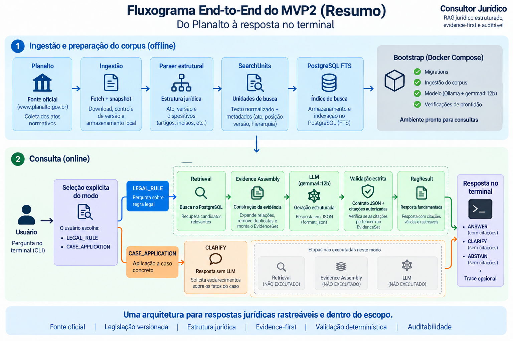

# Consultor Jurídico

O Consultor Jurídico é um RAG local e auditável para consulta normativa sobre
a Lei Federal nº 9.784/1999. O MVP2 combina PostgreSQL FTS, evidências com
proveniência, Gemma4:12b, validação de citações e uma CLI Rich com `QueryMode`
explícito.

## RAG jurídico estruturado e auditável

O sistema não entrega simplesmente os chunks mais semelhantes a um LLM. Ele
transforma legislação oficial versionada em estrutura jurídica, recupera
candidatos, expande relações normativas, constrói um `EvidenceSet` explícito e
rastreável e somente então permite a geração. A resposta usa saída estruturada,
e suas citações são validadas deterministicamente contra as evidências
autorizadas.

```text
RAG tradicional
documento → chunks → retrieval → Top-K chunks → LLM → resposta

Consultor Jurídico
fonte oficial → ato jurídico → versão → estrutura normativa → SearchUnits
→ PostgreSQL FTS → candidatos → expansão estrutural → Evidence Assembly
→ EvidenceSet → answerer estruturado → Citation Validation
→ RagResult auditável
```

O Consultor Jurídico continua sendo um RAG. Sua arquitetura adiciona
rastreabilidade, restrição e validação; não promete verdade jurídica,
eliminação de alucinações ou completude automática. Quando o contrato ou a
evidência é insuficiente, o pipeline falha fechado.



> O ponto central é a separação entre retrieval, construção da evidência,
> geração estruturada e validação das citações.

!!! info "MVP2 — versão congelada"
    Esta documentação descreve a tag oficial `0.2.0`. Ela foi adicionada à
    `main` depois do freeze, sem alterar o produto congelado. Evoluções
    funcionais pertencem ao MVP3 ou a uma versão posterior.

## Quero aprender a construir

Siga o [curso](course/index.md) para reconstruir o MVP2 pelo caminho recomendado,
sem repetir a cronologia experimental.

## Quero entender como funciona

Consulte a [referência de arquitetura](reference/architecture.md), o
[runtime](reference/runtime.md), a [CLI](reference/cli.md) e o
[modelo de dados](reference/data-model.md).

## Quero entender as decisões

Leia os [experimentos](experiments/index.md) para conhecer hipóteses, resultados,
alternativas rejeitadas e condições para reconsiderá-las.

## Escopo em uma frase

```text
Lei 9.784/1999 versionada → PostgreSQL FTS → evidência estrutural
→ Gemma4:12b local → JSON estrito → citações validadas
```

O modelo de linguagem nunca é tratado como fonte jurídica. Consultas comuns
não acessam a web; apenas o bootstrap pode obter o snapshot oficial ausente.
