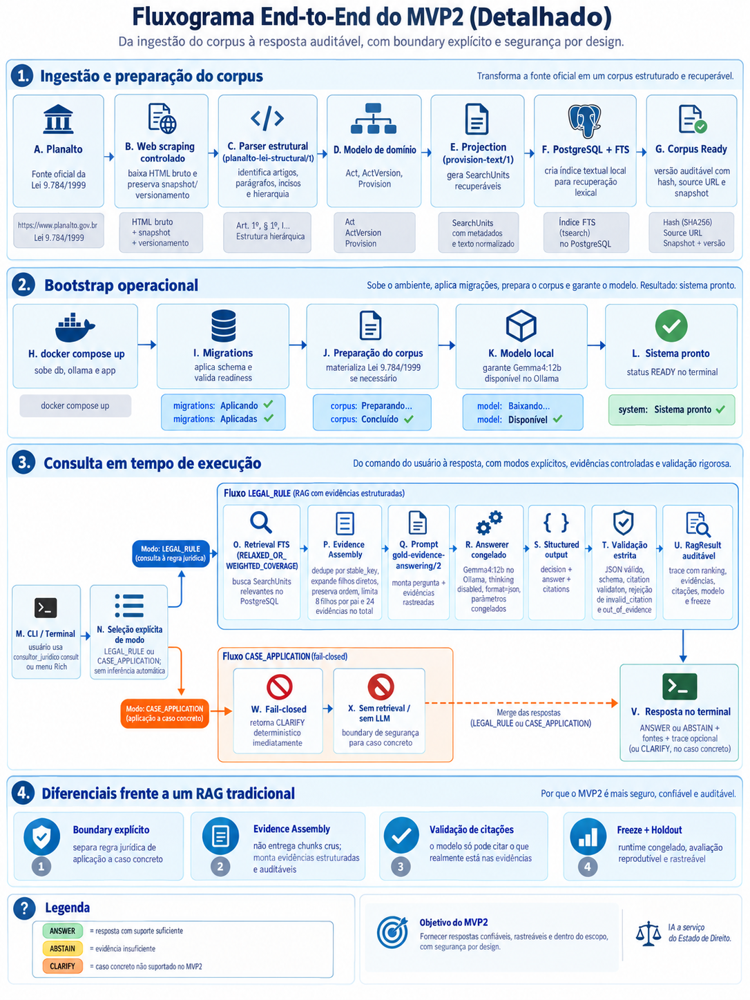

# Arquitetura

## Posição arquitetural

O Consultor Jurídico é um **RAG jurídico estruturado, orientado a evidências e
auditável**. Retrieval e evidência não são sinônimos: a busca retorna candidatos;
o `EvidenceAssembler` acrescenta somente relações estruturais permitidas,
deduplica e forma o conjunto explícito que autoriza a geração.

```text
RAG tradicional
documento → chunks → retrieval → Top-K chunks → LLM → resposta

Consultor Jurídico
fonte oficial → ato jurídico → versão → estrutura normativa → SearchUnits
→ PostgreSQL FTS → candidatos → expansão estrutural → Evidence Assembly
→ EvidenceSet → answerer estruturado → Citation Validation
→ RagResult auditável
```

Essa arquitetura oferece controles adicionais sobre proveniência, contexto e
citações, mas não elimina erros do modelo nem garante completude ou correção
jurídica. A Citation Validation comprova que a referência pertence à evidência
autorizada; não substitui avaliação material da resposta.

## Fluxo end-to-end



### 1. Ingestão e preparação do corpus

O Planalto fornece o HTML oficial. A ingestão preserva o snapshot e sua versão;
o parser identifica a estrutura jurídica e materializa ato, versão e provisions.
A projeção cria `SearchUnits`, que são indexadas pelo PostgreSQL FTS.

### 2. Bootstrap operacional

O Docker Compose sobe os serviços; o bootstrap aplica migrations, prepara o
corpus e o modelo local e verifica a prontidão do sistema.

### 3. Fluxo `LEGAL_RULE`

A busca produz candidatos. O Evidence Assembly deduplica, preserva a ordem e
acrescenta filhos diretos permitidos, formando as evidências autorizadas. O
answerer local recebe a pergunta e essas evidências, retorna o contrato JSON e
a Citation Validation rejeita referências inexistentes ou fora do conjunto.

### 4. Fluxo `CASE_APPLICATION`

O modo retorna `CLARIFY` deterministicamente para solicitar fatos suficientes.
Retrieval e answerer permanecem `NOT_EXECUTED`, e a lista de citações fica
vazia. O modo é escolhido explicitamente pelo usuário ou caller.

### 5. Resposta no terminal

A CLI Rich apresenta `ANSWER`, `ABSTAIN` ou `CLARIFY`, além das fontes cabíveis.
O trace técnico é opcional e preserva a identidade do runtime e o caminho das
evidências.

## Pipeline normativo

```text
Pergunta → PostgreSQL FTS → SearchUnits candidatas → expansão de filhos diretos
         → Evidence Assembly → EvidenceSet → Gemma4:12b → JSON estrito
         → Citation Validation → RagResult
```

O domínio define contratos imutáveis; a aplicação orquestra casos de uso; a
infraestrutura implementa PostgreSQL, HTTP e Ollama; a CLI compõe essas portas.
Essa separação permite testar regras sem serviços reais.

`RunRagQuery` cria o pedido de retrieval, materializa evidências, chama o
answerer congelado, interpreta o contrato e valida as citações. O
`EvidenceAssembler` inclui filhos diretos em ordem documental, com limites 8/24
e deduplicação por `stable_key`.

## Camadas de controle

- **Representação estrutural:** fonte, ato, versão e provisions preservam a
  organização jurídica e a proveniência do corpus.
- **Retrieval:** PostgreSQL FTS encontra `SearchUnits` candidatas; elas ainda
  não constituem automaticamente a evidência final.
- **Expansão estrutural:** filhos diretos autorizados recompõem regras cujo
  sentido está distribuído na hierarquia, dentro de limites determinísticos.
- **Evidence Assembly:** deduplica e ordena o `EvidenceSet` usado na consulta.
- **Geração vinculada:** o answerer local recebe somente as evidências
  autorizadas e deve retornar JSON conforme contrato explícito.
- **Citation Validation:** rejeita referências inexistentes ou fora do conjunto
  de evidências. Essa validação é determinística, mas não certifica a correção
  jurídica da proposição.
- **Resultado auditável:** `RagResult` mantém resposta, evidências, citações e
  estado de validação rastreáveis até o snapshot oficial.
- **Fail-closed:** contrato inválido ou citação não autorizada impede a entrega
  de uma resposta como válida.

## Boundary de aplicação concreta

```text
CASE_APPLICATION → CLARIFY
                 → retrieval=NOT_EXECUTED
                 → answerer=NOT_EXECUTED
                 → citations=[]
```

O caller declara `LEGAL_RULE` ou `CASE_APPLICATION`; o texto nunca é
classificado implicitamente.

## Invariantes

- a fonte oficial é preservada como bytes e SHA-256;
- consulta não acessa a web;
- toda citação deve pertencer ao corpus e à evidência da consulta;
- contrato inválido falha fechado;
- Gold Evidence e HOLDOUT nunca alimentam o runtime.
